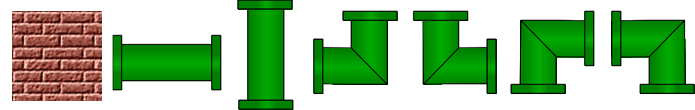
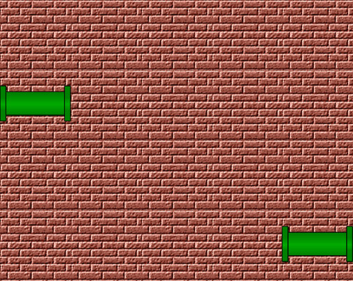
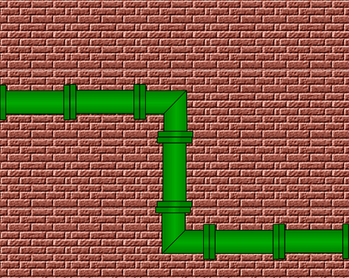
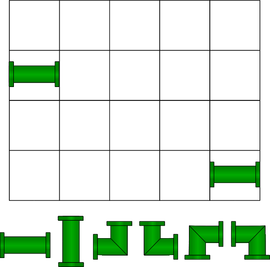

UNTreF - Algoritmos y Programación 1

# Trabajo Práctico: Plomero

## Problema

Construir una cañería que interconecte dos caños localizados en los extremos laterales de una pared.

### Materiales

### Ejemplo de Pared

### Ejemplo de Cañería

## Enunciado

Implementar la clase `Plomero` a partir de la siguiente especificación: [`Plomero.java`](./src/Plomero.java).

Enumerado `Material`: [`Material.java`](./src/Material.java)

## Ejemplo del array `pared`

